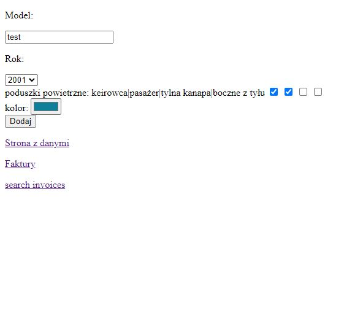
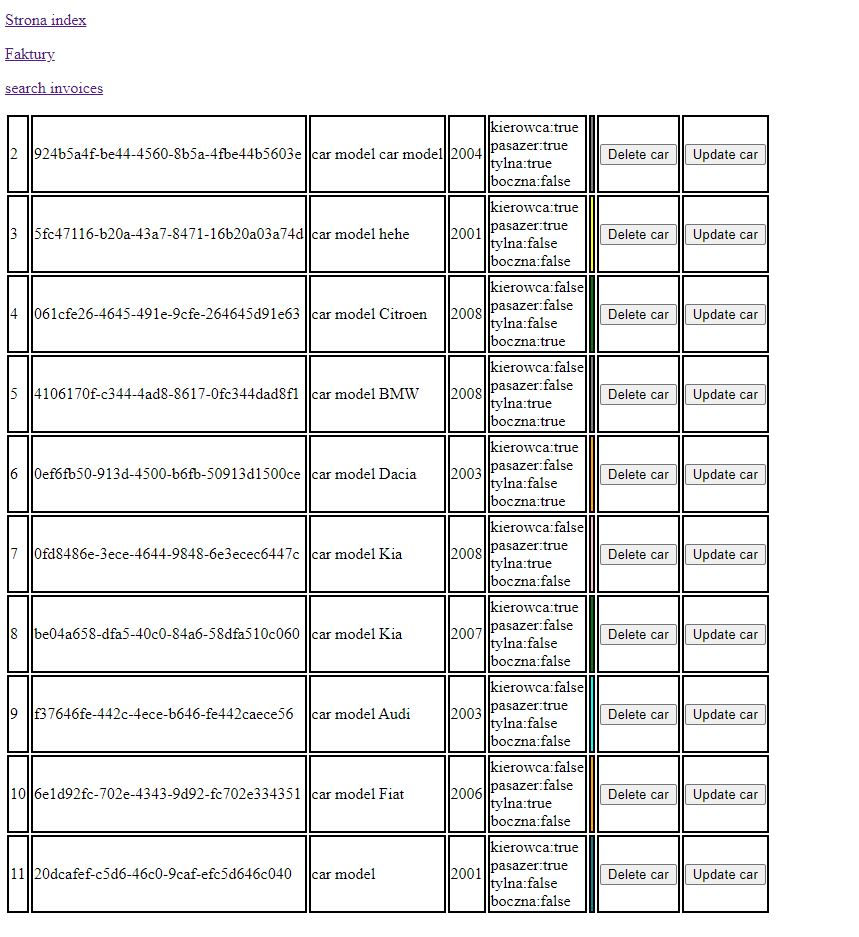
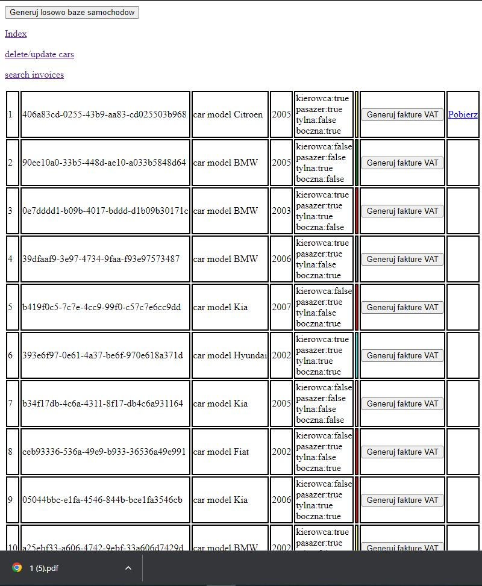
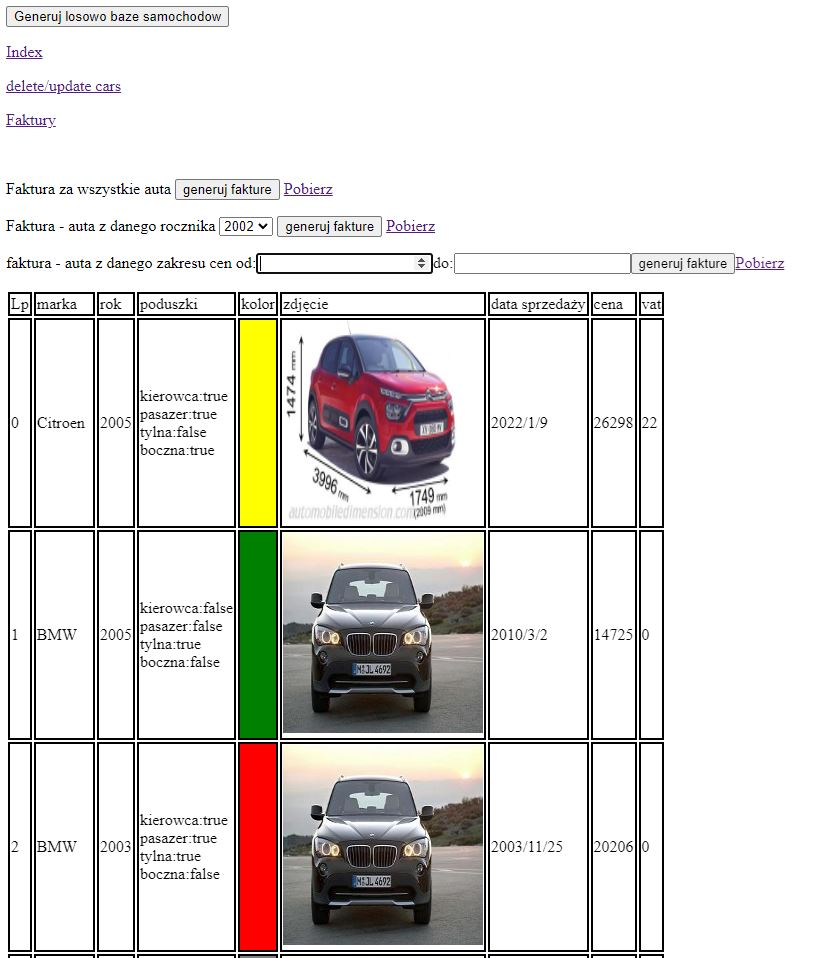

<h1>Car Invoice</h1>
<h2>App created by using java (Spark server) and javascript</h2>
<h2>in this app you can:</h2>
<ul>
  <li>Add car to server</li>
  <li>Change or delete data about added car</li>
  <li>Create and download invoice about selected car</li>
  <li>Create and download invoice about all cars in database or selected</li>
</ul>
<h2>Screenshots</h2>

